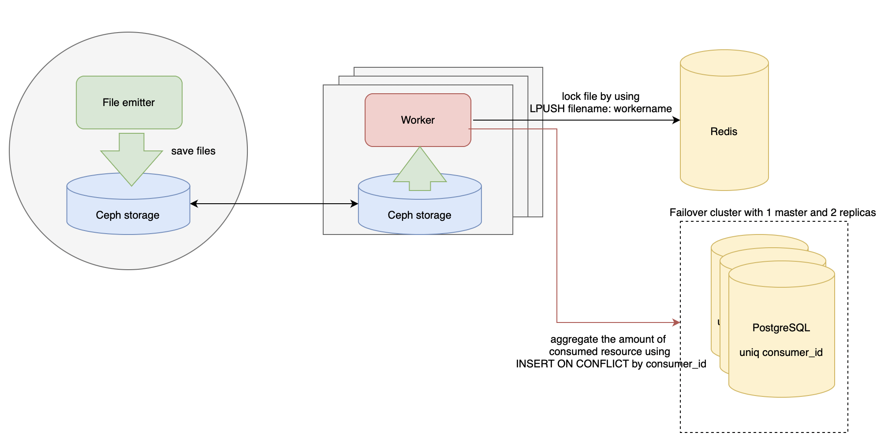

# Demonstrating various options for processing large text files
The idea of the pipelines is layed behind the philosophy of data flows. The data emmitter generates data (in our case files in a proper directories) than consumer process the data and collect them somewhere.

This idea could be implemented by some different ways
- [Demonstrating various options for processing large text files](#demonstrating-various-options-for-processing-large-text-files)
  - [One piece of data (POD) with restart policy](#one-piece-of-data-pod-with-restart-policy)
    - [Handling state](#handling-state)
    - [Potential bottlenecks](#potential-bottlenecks)
    - [Durability](#durability)
    - [Observability](#observability)
    - [Trade-ins](#trade-ins)
  - [Worker pool with Ceph storage](#worker-pool-with-ceph-storage)
    - [Handling state](#handling-state-1)
    - [Durability](#durability-1)
    - [Potential bottlenecks](#potential-bottlenecks-1)
    - [Observability](#observability-1)
    - [Trade-ins](#trade-ins-1)
  - [Worker pool with message queue](#worker-pool-with-message-queue)
    - [Potential bottlenecks](#potential-bottlenecks-2)
    - [Durability](#durability-2)
    - [Observability](#observability-2)
    - [Trade-ins](#trade-ins-2)
  - [Bonus: HDFS + Spark](#bonus-hdfs--spark)
  - [Bonus2: bash + awk :smiley: :smiley: :smiley:](#bonus2-bash--awk-smiley-smiley-smiley)
## One piece of data (POD) with restart policy
Let's look into the simplest case. We assume that
- service emitting the data and saving it to the files (emitter) located in the same space (VM, Kubernetes Pod, etc). 
- emitter saves the files to virtual file system eg mounted to /tmp folder or any volume in the container - now it doesn't matter
- emitter and consumer are located in the same same space (VM, Kubernetes Pod, etc) and will not be able to work in the separate ones

The gathering of the data will be done by periodically scanning the file directory at the virtual filesystem of mounted volume (for example once an hour). The one interesting task is to handle only new files. That means we need to save state after every scanning of the directory. We will accumulate these data in memory and send it to the storage after every scanning.

### Handling state
- scan the whole directory in case of missing data about last scan.
- If the data about last scanning exist, than finding the new files to scan by diffing the list of the files from the directory and list of the files from storage.
- In case of having line number in the state data near the file name, it means that the consumer unexpectedly failed and we need to continue scanning from the next line. It means that the program has been finished fully unexpectedly and was not handled by `SIGTER / SIGKILL` approach. It should be very rare and in such case it's statistically better to undercalculate rather overcalculating. I suppose that the consumed resources will be billed in future and for not decresing the Retention metric. We will not loose the client if we withdraw less than their expected rather than more. 

### Potential bottlenecks
Potential bottleneck here is IO - the disk and the network. But we assume that the speed of the writing file works well and shouldn't be improved and the amount of collected data after processing makes much less than original ones and could be easily handled by the network channel provided us by the cloud provider

### Durability

The durability of the service will be handled by some restart policy for example by container restart policy of Kubernetes with exponential backoff

### Observability

Observability of the service will be handled by Prometheus with Alert manager to send alerts to Slack in case of any incident.
Grafana will be used to display statistics about failures that could be used to calculate potential SLO / SLI.

### Trade-ins
The solution is very simple and could be a good fit for an MVP or in case you don't need a horizontal scaling and very high availability. 
If you need to manage scalability or the network becomes bottlenecks plese look into the next options.

## Worker pool with Ceph storage
In case of necessity to improve scalability we could extend the previous scheme for using multiple workers. Not to handle multiple pieces of disks and keep the simplicity of using the shared one  we could pick some distributed storage like Ceph.

But while introducing scalability we face with the problem of deduplicating data. For example if 2+ workers start processing the same file, the amount of incorrect aggregated data about consumed resource will dramatically increased.  
It could be fixed by handling the state like we explained in the "Handling state" section: in case of having line number in the state data near the file name, it means that the consumer unexpectedly failed and we need to continue scanning from the next line.

### Handling state
Handling state the same as described [here](#handling-state)

### Durability
The durability of the service will be handled by some restart policy for example by container restart policy of Kubernetes with exponential backoff.

Redis could be used as 1 instance because with backup option. Failover of Redises doesn't make sense because in case of failures worker will be able to work on already consumed files and a list of files will not be more than 2Tb ;) In case of really having a necessity to have failover, it's possible to do with Redis. Or to migrate to some distributed solution like ZooKeeper.

To minimize the opportunity of missing data we could build a failover of Postgreses.
But in case of a big amount of writings we will anyway face with a problem when we could 

### Potential bottlenecks

The potential bottlenecks are still Disk IO and potentially could be solved by picking the SSD disks and network in case of using distributed storages.

In case of having network-bloating we could only extend the bottleneck by changing hardware or by using the next option.
The database `INSERT on Conflict` could be a potential bottleneck because of necessity of using `unique index`. In case it is, we could use realtime analitycs approach (could discuss at the interview ;) or switch to some column database adapted for aggregating operations or maybe Postgres + Elasticsearch solution)

### Observability

Observability of the service will be handled by Prometheus with Alert manager to send alerts to Slack in case of any incident.
Grafana will be used to display statistics about failures that could be used to calculate potential SLO / SLI.

### Trade-ins

The solution is more scalabe and fault-taulerant and provides high availability than previous one.
From the other hand the trade-in will be potential infrastructure overhead because of necessity to deploy / scale and support worker-services, Ceph cluster and fault-taulerant DBs. 
In case of network is still bottleneck, we could forecast network overpricing in case of using public clouds,or pick the next option

In case of a big amount of writings we will anyway face with a problem when we could loose the data when DB fails and replicas swithching to masters.

## Worker pool with message queue

In case we need more scalable solution and want to have a network trafic under control (trade-in - speed of calculations).
In such case we use the model of publisher-subscriber.
Moreove such architecture allows to handle more than one piece of data saving data to disks.
Publisher is:
- scanning the directory
- then parsing the lines and tranforms it to the data to put onto queue. In go it's possible to use **goroutine pool** for handling any file in parallel and still be able to utilize the resources.
- To utilize the network better it pre-aggregates some data in memory, summarazing the consumed_resource for example using `map` with `mutex`.
- Worker consumes the data and saves it to the database. 

Such architecture allows to handle more than one machine saving data to disks and solves the problem of the previous scheme - it is nearly impossible to get the system in an incosystent state and loose the data.

### Potential bottlenecks

The potential bottleneck here is message queue. If it fails, the solution stucks. But usually they are quite stable and fast and it's possible to biuild a failover here. The next botleneck is that the system is eventually consistent and the data already in the list of files will be aggregated... eventually. If the amount of files will start dramatically increasing, the period between scanning should be also increased.

### Durability

The durability of the services will be handled by some restart policy for example by container restart policy of Kubernetes with exponential backoff.

To minimize the opportunity of failing the message queue, we could build a failover.

To minimize the opportunity of missing data we could build a failover of Postgreses. And again, comparing with the previous option with such solution we will never loose the data.

### Observability

Observability of the service will be handled by Prometheus with Alert manager to send alerts to Slack in case of any incident.
Grafana will be used to display statistics about failures that could be used to calculate potential SLO / SLI.

### Trade-ins
The solution could potentially solve the problem of system inconsystensy and quite durable. But the trade-in here is in eventually consystensy, that after consuming some resource, it will be displayed in a statistics not really realtime but...eventually.

## Bonus: HDFS + Spark

## Bonus2: bash + awk :smiley: :smiley: :smiley:
`cat file1.txt file2.txt file3.txt file4.txt | awk '{a[1] += $2} END {for (i in a) print i,a[i]}' > mergedfile`
